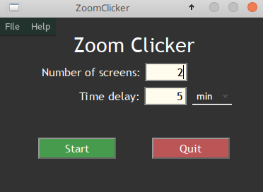

# ZoomClicker

A small app to automatically switch pages during a Zoom session in gallery mode.

The purpose of this program is to automatically switch pages while viewing a >25 participant Zoom meeting in gallery mode. The application was inspired by participating in a Quaker Meeting for Worship, where members of the Society of Friends gather in silent worship.  For most of the the hour-long worship, Friends sit in silence, so Zoom does not have a speaker to focus on.  This program periodically cycles through the pages at a preset rate, allowing the participant to see all other participants, even those on other pages, and freeing him/her/them to focus on spiritual aspects of the worship rather than the mechanics of their computer.

<h3>INSTALLATION INSTRUCTIONS:</h3>

<h4>Windows executable:</h4>
Download <code>install_ZoomClicker.exe</code> and double-click on it. Follow the prompts on the installer and ZoomClicker will be installed on your computer.  Windows may warn you that you are installing software from an unknown publisher.  That's because I wrote the code and Microsoft doesn't know about me.  It is safe to choose "install anyway". An icon will be added to your start menu to start the program. If you decide you want to uninstall the program, right-click this icon and choose "uninstall".       

<h4> MacOS:</h4>
Use the Python source code and run from a Terminal. You will probably need to give Terminal permission to control the computer via Accessibility In System Preferences/Security and Privacy/Privacy.

<h4>Python source code:</h4>
You can also run the program using your system's Python 3.x installation. Download <code>zoomclicker.py</code>, <code>zoomclicker.ui</code>, <code>about.ui</code>, <code>LICENSE.txt</code> and <code>ZoomClickerHelp.pdf</code> into a suitable folder. Install the Python module <code><a href="https://pypi.org/project/PyAutoGUI/">pyautogui</a></code> by typing <code>pip3 install pyautogui</code> at a command prompt.  Then run the program by typing <code>python3 zoomclicker.py</code> at a command prompt.  

<h3>USAGE INSTRUCTIONS:</h3>
<ol>
<li>Start your Zoom meeting normally. Maximize the window, but don't go into full screen mode. Start the ZoomClicker application.
</li>       
<li>Enter the number of screens expected in the Zoom meeting (2 if there will be between 25 and 50 people, 3 if there will be between 50 and 75 people, etc.).  Enter at least two screens.
</li>   
<li>Enter the desired time interval between screen switches, selecting minutes or seconds, as appropriate.  Too short an interval may become distracting; too long an interval may not give you a chance to see everyone enough.  Try five minutes start and then adjust to your liking. Don’t enter less than 3 seconds, or you will lose mouse control.  If this happens, you can wait for 100 clicks, after which the program will exit. 
</li>    
<li>Press Start.  Your mouse will be occupied by the program for about a half second as it switches pages at the end of each time interval.  Otherwise it will be available for your use.  
</li>       
<li>If you wish to change the settings at any time, enter new values and press Start again.
</li>   
<li>Press Quit when your meeting is over.</li>
</ol>
